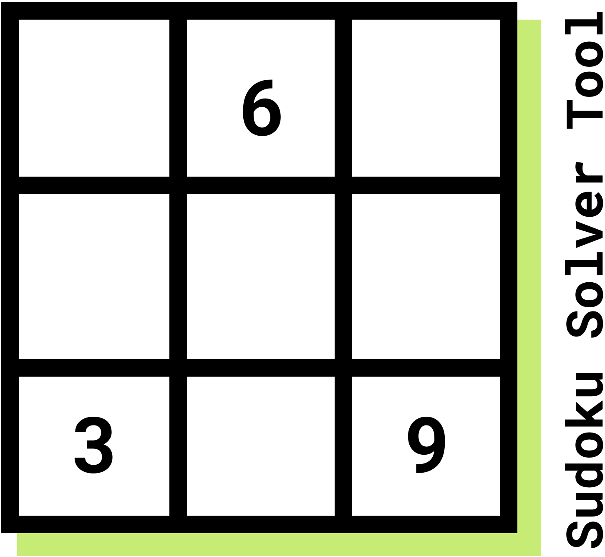

# Projet
Jeu de sudoku en React, développer comme projet final du cours de POO2. De plus, notre équipe avait pour défi de développer en respectant les différentes contraintes de la programmation immuable.

# Rapport de projet
Pour tester et jouer au sudoku, [appuyer ici!](https://sudoku-uqtr-boys.s3.us-east-2.amazonaws.com/index.html)

## Rapports Phase 1
## Principes SOLID
* ### Principe de responsabilité unique
  Le principe de responsabilité unique dit qu'une classe doit avoir une seule et unique responsabilité dans son 
  implementation. De plus toutes ces méthodes offertes doivent être en lien direct avec cette responsabilité. L'une des
  meilleurs exemples dans notre projet est notre classe `GridGenerator`, qui s'occupe de la generation d'une nouvelle
  grille de jeu partiellement commencer.
    
  

  On peut voir que la classe a qu'une seule et unique responsabilité qui est de générer une grille. Un autre exemple serait
  notre classe `File` qui s'occupe de l'écriture et de la lecture d'un fichier pour la sauvegarde et le chargement d'une grille.
  
  
* ### Principe Ouvert/Fermé
    Un exemple de la façon dont notre projet implémente le principe SOLID Ouvert/Fermé, est par l'utilisation d'interfaces pour nos classes de Sudoku, `ICell` et `IBox`. Ces interfaces font en sorte que l'extension des fonctionnalités de notre programme, avec des `Cell` et des `Box` répondant à des critères différents, se ferait sans impacter les fonctionnalitées existantes. Un exemple de modifications qui pourraient bénéficier de notre choix d'utiliser les interfaces mentionnées ci-haut, est que notre `Grid` pourrait utiliser des `Cell` ou des `Box` avec des comportements différents, sans avoir besoin de faire un énorme réusinage du code.

* ### Principe de substitution de Liskov
  Pour ce projet nous avons plusieurs exemples qui correspondent au principe
  de substitution de Liskov, il s'agit de `IBox.ts` et `ICell.ts`. Les classes `Box.ts` et `Cell.ts` héritent de ces
  interfaces respectivement. Dans notre programme, lorsqu'on veux utiliser ces variables, on passe leur interface comme type
  de variable pour la fonction. De cette façon, si on crée une nouvelle classe qui hérite d'une de ces interfaces elle va pouvoir
  être envoyer comme paramètre. Donc, si on change une `Cell.ts` par cette nouvelle classe `SpecialCell.ts`, elle va fonctionner sans
  problème dans notre programme. Même avec l'implémentation fonctionnelle, nous n'avons pas d'autres classes qui héritent d'une même interface car nous avons
  pas vu l'intêret d'en créer d'autres.
  
* ### Principe de ségrégation d'interface
    Le principe de ségrégation d'interface indique qu'il est mieux d'utiliser plusieurs petites interfaces au lieu d'une seule grande interface. Cela permet de mieux séparer
    les fonctionnalités. Dans notre projet nous avons quelques interfaces comme `ICell.ts`, `IBox.ts` et `ISavable.ts`, celles-ci permettent de découper des fonctionnalités en
    en plus petites parties. Dû à la nature du projet, et de la facon dont nous l'avions approché, nous n'avons pas eu la chance de faire assez d'interfaces qui demandait à être
    séparé en plus petites. Les quelques interfaces que nous avions créées étaient pour des entités de sudoku comme `Box.ts` et `Cell.ts`. 

  

* ### Principe d'injection de dépendance
    Dans notre cas, les fonctions `save()` et `load()` de la classe `Grid` utilisent une interface `IFile` qui 
    définie les fonctions qu'un fichier devrait contenir ainsi, la responsabilité d'instancier un object qui 
    implémente `IFile` revient à l'utilisateur de `Grid`. Ceci nous permet d'implémenter, à la fois, une vraie 
    classe pour sauvegarder et charger des fichiers et un MockFile qui nous permet de faire des tests. Par exemple, 
    dans le test `TestGridSave()` qui, comme le nom l'indique, test si la sauvegarde du fichier fonctionne 
    correctement en utilisant une propriété dans `FileMock`au lieu de réellement écrire dans un fichier.


## Principes GRASP

* ### Créateur
    Le projet utilise le principe GRASP de créateur pour générer la grille du sudoku, l'initialisation des `Grid` est faite dans la classe `GridGenerator` et retourne une grille de jeux partiellement compléter. Un autre exemple de créateur serait dans 'App.tsx' qui fait la création d'une nouvelle `Cell` lorsqu'on sauvegarde les informations reliées à celle-ci. Puisque notre code doit être immuable nous ne pouvons changer les propriétés d'une `Cell`, nous devons en créer une nouvelle et c'est `App.tsx` qui s'occupe de prendre les données nécessaires et de créer une nouvelle cellule à partir des informations de l'ancienne et de l'information changée par l'utilisateur.

* ### Spécialiste de l'information
    Le projet utilise le patron spécialiste de l'information pour la validation du sudoku, au lieu de donner la responsabilité a la classe `Cell`(qui connait seulement sa valeur et ses commentaires), la validation ce fait dans `IBox`, qui valide que tous ces `Cell`, 9 au total, ait une valeur différente. La validation se fait aussi dans `Grid` qui valide les colonnes et les rangés de celle-ci. Pour résumé, la validation d'une grille se fait dans `Grid`, en ce qui est pour les colonnes et les rangés, et dans `IBox` pour la validation d'une boite 3x3, chaqu'un qui connait toute l'information nécessaire pour faire la validation.

* ### Contrôleur
    Le projet utilise en quelque sorte un contrôleur nommé `App.tsx` situé dans le dossier `views` qui s'occupe 
    essentiellement de faire la connection entre le front-end et le back-end. Il s'occupe, par exemple, de lier la
    sauvegarde et le chargement d'une `Grid` en back-end au front-end qui affiche la grille générée et permet de
    convertir la grille dont l'utilisateur a modifié en un objet `Grid` dont le backend peut utiliser pour faire
    la sauvegarde.


## Rapports Phase 2

## Patron GOF

* ### Décorateur (PAS FINI VRAIMENT PAS BON TEXTE)
    Le projet utilise le design pattern du Décorateur avec la fonction de undo / redo. En effet, puisque nos 
    grilles de jeux implementent l'interface IGrid, nous pouvons donc utiliser n'importe quelle grille dans 
    notre jeu de sudoku. Par exemple, le décorateur est implémenté avec notre `RememberingGrid`, qui prend en
    paramètre une `IGrid`, et qui va utiliser cette `IGrid` au travers de chacune des fonctions d'une `IGrid`
    qui vont seulement appeler cette `IGrid`. De plus, `RememberingGrid` est un décorateur puisqu'il va garder
    une historique de chacun des états de la `IGrid` lorsqu'il y a une modification pour pouvoir permettre le 
    comportement du undo / redo.


* ### Fabrique
    Notre projet utilise le design pattern de Fabrique pour la création d'une grille de jeu. Nous avons une classe
    abstraite `GridFactory` qui demande a tout ceux qui l'hérite de définir `createGrid(gridContent?: string)`, de
    cette facon nous pouvons facilement créer nos deux types de grille de jeu soit `RememberingGrid` et `Grid`, 
    et cela viens facile a supporter si nous ajoutons de nouveau type dans le futur. Dans notre cas nous avons du 
    utiliser une classe abstraite au lieu d'une interface puisque en TypeScript nous ne pouvons définir de méthode
    non abstraite et pour éviter de copier du code on donne les fonction `makeGrid` et `getRandomString` a la classe
    parent pour permettre de créer une grille de jeu partiellement remplie si c'est le cas.
    

* ### Itérateur
    Notre projet utilise le design pattern de l'Itérateur à plusieurs endroits dans le code. L'un des meilleurs exemple
    est la fonction `update()` dans `Grid`.
    ```
  public update(newCell: ICell[]): Grid {
      let boxes = this.boxes;
      let newBoxes: IBox[] = [];
      boxes.forEach((box) => {
        let newCells: ICell[] = [];
        let cells = box.getCells();
        cells.forEach((cell) => {
          let index = newCell.findIndex(c => c.getId() === cell.getId());
          if (index !== -1) {
            newCells.push(newCell[index])
          } else {
            newCells.push(cell);
          }
        })
        newBoxes.push(new Box(newCells));
      });
      return new Grid(newBoxes);
  }
    ```
  La fonction (montré ci-dessus), utilise le patron d'itérateur sous forme de foreach, nous aurions pu faire notre propre
  Itérateur si il faudrait faire quelque chose d'autre comme que de simplement itérer a travers notre collection comme modifier notre liste mais dans notre cas nous avons pas besoin,
  dans les endroits ou nous avons besoin de le faire on fait simplement une nouvelle liste basé sur celle qu'il faut changer
  puisque notre code doit rester immuable le plus possible. Pour ceci, nous avons décider d'utiliser des foreach qui sont des
  itérateur mais avec ce qu'on appele du `syntactic sugar`.

## Tableau Responsabilités
| Tâche                              | Responsable(s) |
| ---                                | ---         |
| Interface graphique (phase 1)      |Piérik, Mickael, Hugo|
| Notation spéciales (phase 1)       |Xavier, Hugo, Pierik|
| Système de vérification (phase 1)  |Xavier, Maxime|
| Sauvegarde et chargement (phase 1) |Maxime, Mickael|
| Tests unitaires (phase 1)          |Xavier, Maxime, Mickael|
| Rapport (phase 1)                  |Xavier, Maxime, Mickael, Hugo, Piérik|
| Undo/Redo (phase 2)                |Mickael, Xavier, Hugo, Maxime|
| Couleurs (phase 2)                 |Piérik, Hugo|
| Sélection multiple (phase 2)       |Hugo, Mickael|
| Tests unitaires (phase 2)          |Xavier, Maxime|
| Rapport (phase 2)                  |Mickael, Maxime, Hugo, Xavier, Piérik|

## Tests Unitaires

  Pour faire marcher les tests unitaires il suffit :
  1. Cloner le projet
  2. Aller dans le projet
  3. Exécuter la commande `npm install`
  4. Exécuter la commande `npm test` *Il y a environ 47 tests dans 4 suites différentes
  5. S'il y a seulement quelques tests qui ont été exécutés, appuyer sur la touche `a` pour exécuter tous les test
